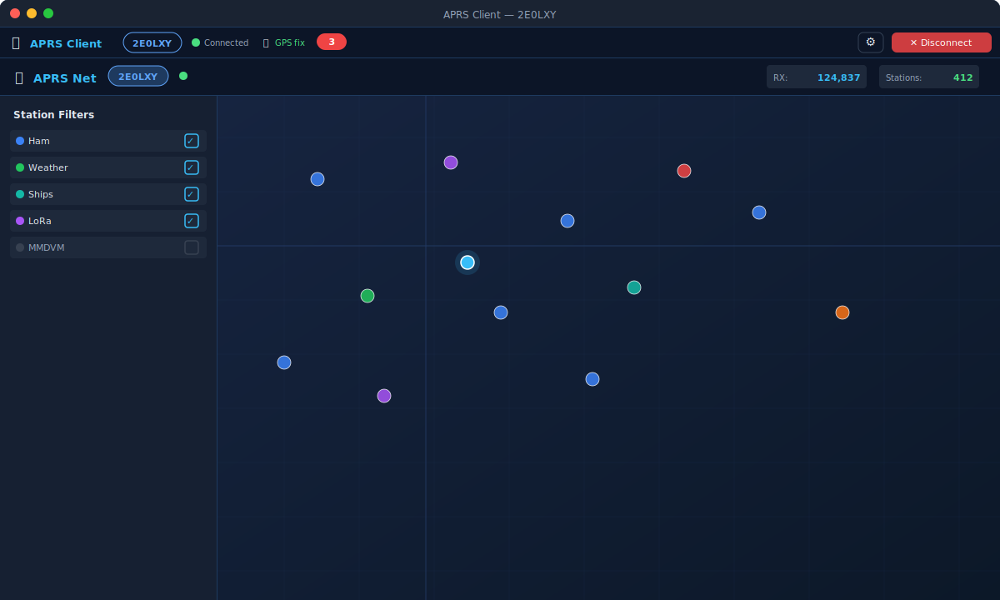

# APRS Client

Cross-platform desktop client for [aprsnet.uk](https://www.aprsnet.uk) — Windows 10/11 and Debian/Ubuntu Linux.

Built with Electron: wraps the full server web UI in a native desktop application with system tray, native OS notifications, GPS positioning, auto member login, two-way filter persistence, real-time settings sync, and persistent appearance settings.

[](https://github.com/2E0LXY/APRS-Client/releases)
[](https://www.gnu.org/licenses/gpl-3.0)


---

## Also available on


| Platform | Repository | Download |
|----------|------------|----------|
| **Android** | [2E0LXY/APRS-Android](https://github.com/2E0LXY/APRS-Android) | [APK](https://github.com/2E0LXY/APRS-Android/releases) |
| **iOS** | [2E0LXY/APRS-iOS](https://github.com/2E0LXY/APRS-iOS) | [Releases](https://github.com/2E0LXY/APRS-iOS/releases) |
| **Self-host the server** | [2E0LXY/Advanced-APRS-Go-server](https://github.com/2E0LXY/Advanced-APRS-Go-server) | [Install guide](https://github.com/2E0LXY/Advanced-APRS-Go-server#installation-debian-12) |

---

## Download

See [Releases](https://github.com/2E0LXY/APRS-Client/releases) for:
- `APRS.Client.Setup.x.x.x.exe` — Windows 10/11 NSIS installer
- `aprs-client_x.x.x_amd64.deb` — Debian/Ubuntu package

---

## Features

### Full aprsnet.uk Web Dashboard

The complete server web UI runs inside the app — everything available at www.aprsnet.uk is available here:

- Live APRS station map with clustering, trails, PHG range circles, solar day/night terminator
- TOCALL-based station classification (LoRa, MMDVM/DMR, OGN, CWOP weather)
- Station type filters and sub-filters; station ghosting; auto-fit zoom
- **Smart search** (Ctrl+K) — searches callsigns, comments, messages, devices
- **Time-lapse replay** — rewinds station history at 10×–240× speed
- Station detail modal with history, packet log, path tabs, QRZ.com profile
- **Messages centre** — conversations inbox sidebar, thread view, compose bar, 5-row traffic log
- Weather dashboard, UK Met Office severe weather warnings, animated RainViewer rain radar
- Propagation analytics, activity and coverage meters, activity heatmap
- ISS / ARISS live position and pass countdown
- Utilities: passcode calculator, Maidenhead converter, beacon generator, symbol picker
- Admin panel: full server configuration, API keys, webhooks, audit log, ban list, backup/restore
- **Geo-fence Alerts panel** — create and manage server-side enter/exit rules
- **Member settings panel** — quiet hours, map filter preferences, **Ecowitt weather station** configuration (API keys, MAC, beacon interval, WX SSID, pressure source, optional comment fields, Test Connection button)

### Desktop Integration (`client-overlay.js`)

The overlay is injected into every aprsnet.uk page load and adds native desktop behaviour:

- **Toolbar** — pinned bar at top of page showing callsign, WebSocket connection state (reads `#conn-status` from the DOM), GPS fix indicator, unread message count badge, and Disconnect button
- **Native OS notifications** — incoming APRS messages trigger Windows/Linux system notifications via the Electron main process; fires even when the window is minimised to tray
- **Auto member login** — signs in to your aprsnet.uk member account on every page load using saved credentials; the member panel and messages centre open pre-authenticated
- **Real-time settings sync** — the app inherits the web page's `member_sync` WebSocket handler; when preferences are saved from Android, iOS, or another browser tab, the changes appear in the settings panel and on the map without a page reload
- **Two-way filter persistence** (v1.2.1+) — change listeners on all 21 filter checkboxes (`show-aprs`, `show-cwop`, `show-ogn`, `show-ships`, `show-lora`, LoRa sub-filters, `mp-drop-pistar`, `mp-drop-dstar`, `mp-drop-apdesk`, etc.) capture every change and persist it via `saveSettings`; all 21 are restored and applied on every reconnect
- **GPS map marker** — plots your location using the OS location services (via `main.js` `ipcMain` → `webContents.send`) or manual coordinates configured in the connect screen
- **Theme control** — stores dark/light preference; applies `data-theme="dark|light"` to the page on every load

### System Integration

- System tray icon with context menu: Open, Reload, Disconnect, Quit
- Minimise to tray on window close (configurable)
- Launch on Windows startup with optional start-minimised mode
- Single-instance lock — re-launching focuses the existing window rather than opening a second

---

## First Run

1. Launch the app
2. Enter callsign and APRS-IS passcode
3. Enter your aprsnet.uk member account credentials (for auto-login, filter sync, and direct messaging)
4. Tick **Remember me and connect automatically** to skip this screen on future launches
5. Click **Connect to APRS Net**

The full web dashboard loads inside the app with the client toolbar at the top.

---

## Settings

Click ⚙ in the toolbar to open the Desktop Settings dialog:

| Setting | Description |
|---------|-------------|
| Desktop notifications | Enable / disable OS message notifications |
| Minimise to tray | Window close minimises rather than quits |
| Launch on startup | Register with OS startup items |
| Auto-connect | Skip the connect screen on launch |
| Theme | Dark / Light — applied to the site on every page load |

Full settings (callsign, passcode, member account, GPS source, appearance) are on the connect screen.  
All settings are stored in `settings.json` in the Electron `userData` folder.

---

## Cross-device Sync

The desktop client participates in the same cross-device sync as Android and iOS:

| What syncs | Trigger | Direction |
|------------|---------|-----------|
| Map filter preferences | Login (auto) | Server → Desktop |
| Map filter preferences | Any checkbox change | Desktop → Server → All devices |
| Message history | Login (auto) | Server → Desktop (via `loadMemberMessages()`) |
| New messages | Real-time | All devices → Server → Desktop (WS `rx` packet) |
| Settings changes | Any save | Any device → Server → Desktop (`member_sync` WS push) |
| Ecowitt WX config | Settings save | Desktop → Server → All devices |

---

## Building from Source

### Prerequisites
- Node.js 18+
- npm

### Install and build
```bash
git clone https://github.com/2E0LXY/APRS-Client
cd APRS-Client
npm install

# Run in development
npm start

# Build Windows installer (requires Windows or Wine)
npm run build:win -- --publish never

# Build Linux DEB
npm run build:linux -- --publish never
```

Every push to `main` builds installers; pushing a `v*` tag publishes them as a Release.

---

## Architecture

```
main.js              — Electron main: BrowserWindow, tray, IPC, GPS store,
                       single-instance lock, launch-on-startup
preload.js           — contextBridge: exposes aprsClient API to renderer
renderer/
  connect.html       — Connection / settings screen (callsign, passcode, member, GPS)
  client-overlay.js  — Injected into aprsnet.uk pages:
                         • desktop toolbar (callsign, WS state, GPS, unread badge)
                         • auto member login
                         • native OS notification bridge
                         • two-way filter persistence (21 checkboxes)
                         • GPS map marker forwarding
                         • theme application
                         • member_sync WS event handling
assets/
  icon.png / icon.ico / icon.svg
```

The overlay never modifies the server — it drives the site's own DOM controls, so it remains fully compatible with any server update.

---

## Changelog

| Version | Changes |
|---------|---------|
| v1.2.2 | Geo-fence alert hook in overlay — forwards `alert` WS events to Electron `ipcRenderer` for native OS notification |
| v1.2.1 | Fix WS state dot (reads `#conn-status` DOM correctly); two-way filter persistence via change listeners on all 21 checkboxes |
| v1.2.0 | `client-overlay.js` — desktop toolbar, auto member login, OS notifications, GPS forwarding, preference application |
| v1.1.0 | Single sign-on, appearance memory, GPS map marker, quick message composer, launch on startup, single-instance lock |
| v1.0.x | Initial release — Electron wrapper, system tray, native notifications, connect screen |

---

## Licence

GNU General Public Licence v3 — © 2026 Daren Loxley 2E0LXY
